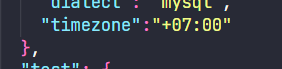
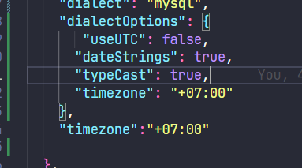

# GRE Collecting Ideas System

This repository is using Nodejs, ExpressJs, React and Mysql to make a project:

- Communicate between client and server via API calling.
- Basic knowledge to structure file and code
- Testing the functions that will be required in Collecting Ideas project

## How to execute project in your local:

1. Create a database, named ["gre_ideas_db"] by default of my project. Or if you change the name, make sure you have config the name of the database in the config file (stored in server/config/default).

2. install packets/lib require for each client and server folder. Because the node_modules files is heavy and time consuming in pushing the code to remote.
   Command in the Terminal like this:

```
cd server
npm install
cd ..
cd client
npm install
```

3. After that, install dependencies list in the /server/package.json
   > "body-parser": "^1.20.1",
   > "express": "^4.18.2",
   > "mysql2": "^3.1.2"
   > "nodemon":
   > "sequelize"
   > "bcrypt"
   > "jsonwebtoken"

Sample:

```
npm install mysql2
npm install --save-dev nodemon
```

4. Next, install dependencies in /client

   >

5. Create tables, named in the ["gre_ideas_db"] like the query in the folder /server/db/create_table.sql

6. Dummy data by execute the query in the file /server/db/dummie_data.sql (Optional -> Cause the using db is moved to Sequelize) (Skip to the step 7)
7. Run the command

```
npx sequelize-cli db:migrate
npx sequelize-cli db:seed:all
```

## References/Guideline of this Project

Uploading the project to Github, ref: https://dev.to/birdy/mern-stack-project-setup-to-push-to-github-4l5e

### Some errors when implementing code:

1. Lack of dependencies
2. Forget to delete "git init" in react app folder, when initializing it
3. Not connect to the api, especially setup "proxy" to fetch data from api in /client
4. Not config the file to match with local machine
5. Unable to resolve dependencies.


Ref: https://stackoverflow.com/questions/64573177/unable-to-resolve-dependency-tree-error-when-installing-npm-packages

### Step to using Sequelize

1. Install all packages need for it in the official website
2. Run the command to have four folder

   - config, contains config file, which tells CLI how to connect with database
   - models, contains all models for your project
   - migrations, contains all migration files
   - seeders, contains all seed files

```
npx sequelize-cli init
```

3. Configuration the config.json in the folder config ('dialect' used for declaring database using)
4. Create the first model as the following command

```
npx sequelize-cli model:generate --name User --attributes firstName:string
```

5. Running migrations

```
npx sequelize-cli db:migrate
```

add suffix

- :undo, for undo the migrate
- :undo:all, for undo all migrate
- More on official website Sequelize

6. Running first seed (as dummy data into the database)

```
npx sequelize-cli seed:generate --name demo-user
```

### Gains Knowledge

1. The Sequelize will be used for migrating, but the code will be generate as the structure; therefore, developer need to add more specific code to make the db work well. For example: the code after changing from model will not affect to the migrate file, but it will be helpful in the development, as model has the same attribute in the database -> Maybe that's why the ORM stand for.
2. By default, the timezone of the Sequelize is UTC -> Therefore, if want to set the time zone ICT, you must define it in the config file.

   
   And update the timezone of the dialect in Sequelize like this

   

3. The Date in the function create of Sequelize will return UCT time, which is not the time I want. Therefore, need to create a constance to hold the created thing by the findOne function.
